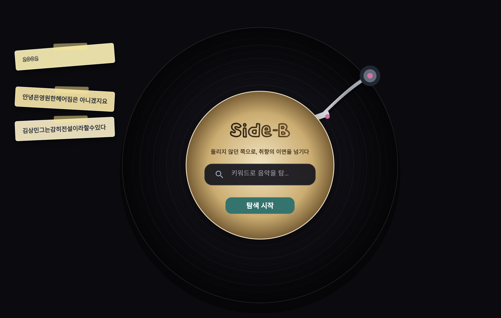

# 프로젝트 명: Side-B
# 팀 명: Six Sense

<p align="center">
  
</p>

Side-B는 레코드의 B-side처럼 가려진 음악들을 다시 들려주는 서비스입니다. 
사용자가 곡·아티스트·키워드를 입력하면 Spotify·Last.fm 데이터를 활용해 **유사 추천, 반대(Reverse Top 100) 스타일, 반대 무드 탐색, 숨은 곡 후보** 등을 함께 보여 줍니다.

## 구성 요약


| 구분        | 기술                     | 역할                                            |
| --------- | ---------------------- | --------------------------------------------- |
| **프론트엔드** | Flutter Web (Dart 3.x) | 검색 UX, 결과 시각화(그래프·카드·그룹 목록), API 호출           |
| **백엔드**   | FastAPI + Python       | `/health`, `/recommend` 등 REST API, 추천·정규화 로직 |
| **프록시**   | nginx                  | 정적 빌드 서빙, `/api/`* → 백엔드로 역프록시 (동일 출처 통신)     |
| **캐시**    | Redis 7                | 외부 API 응답 캐싱                                  |


## 디렉터리 구조 (요약)

- `frontend/` — Flutter 웹 앱 (`lib/screens/search_screen.dart`, `result_screen.dart` 등)
- `backend/` — FastAPI 진입점 `main.py`, `recommend_algo.py`, 테스트·서비스 모듈
- `docker-compose.yml` — `backend`, `frontend`, `redis` 서비스 정의

## 빠른 실행 (Docker)

1. 저장소 루트에 `.env`를 준비합니다. (Spotify·Last.fm·선택 Gemini 키)
2. 다음을 실행합니다.

```bash
docker compose up --build
```

- **프론트**: 기본적으로 `http://localhost:3000` (포트는 `FRONTEND_PORT`로 변경 가능)
- **백엔드**: 기본적으로 호스트의 `BACKEND_PORT`(미설정 시 `8000`). 프론트 빌드 시 `API_BASE_URL`이 보통 `/api`로 두어 nginx가 백엔드로 넘깁니다.
- **헬스**: `GET http://localhost:<BACKEND_PORT>/health`

## 환경 변수 (요약)

`docker-compose.yml`에서 참조하는 대표 변수입니다.


| 변수                                            | 용도                                         |
| --------------------------------------------- | ------------------------------------------ |
| `SPOTIFY_CLIENT_ID`, `SPOTIFY_CLIENT_SECRET`  | Spotify Client Credentials                 |
| `LASTFM_API_KEY`, `LASTFM_API_SECRET`         | Last.fm API                                |
| `GEMINI_API_KEY`, `GEMINI_MODEL`              | (선택) LLM 연동 시                              |
| `REDIS_URL`                                   | 컨테이너 간 기본값 `redis://redis:6379/0`          |
| `BACKEND_PORT`, `FRONTEND_PORT`, `REDIS_PORT` | 호스트 포트 매핑                                  |
| `API_BASE_URL`                                | 프론트 웹 빌드 시 백엔드 베이스 (Docker에선 관례적으로 `/api`) |


실제 예시 파일이 있다면 루트 또는 `backend/`의 `.env.example`을 복사해 사용하세요.

## API 요약

- `**POST /recommend`** — 검색 문자열과 반환 개수 등을 받아 정규화된 기준 트랙 정보와 카테고리별 추천 리스트(JSON)를 반환합니다.

프론트는 브라우저에서 같은 출처 기준 `**/api/recommend**` 로 요청하면 nginx가 위 경로로 전달합니다.
